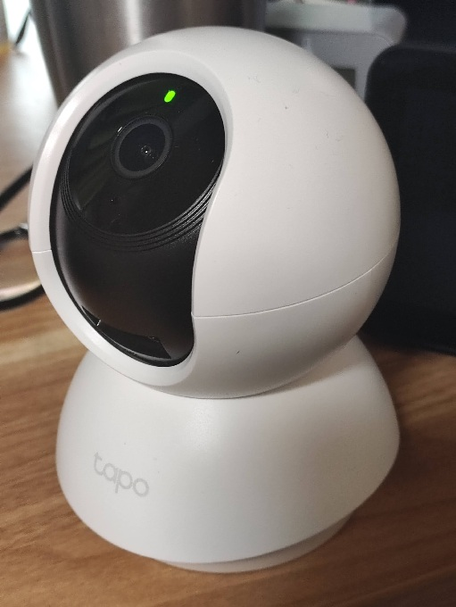

# Yatagarasu

Tapo見守りカメラ（TC70/C200/C220等）をロボット化するためのローカル実行プロジェクトです。  
音声認識（`listend.py`）・発話（`zunda` + `tapovoice`）・カメラ連携（go2rtc）・記憶（SemanticMemory）を組み合わせて動作します。

## Demo
   
[Demo Video](https://tanep.work/yatagarasu/demo/yatagarasu_demo.mp4)  
> ブラウザで直接再生されない場合はリンク先を開いてください。

## なぜ Yatagarasu（八咫烏）なのか

八咫烏は、天照大神の使いとして「導き」の象徴とされる存在です。  
このプロジェクト名には、急速に進化するAIをロボットへ融合し、実世界へ導くという意図を込めています。

また、Tapoカメラが持つ以下の3要素を、八咫烏の3本の足になぞらえています。

- CCD（目）
- マイク（耳）
- スピーカー（口）

## 構成概要

- user systemd
  - `go2rtc`（カメラ中継）
  - `listend.py`（常時リッスン / wake-stop / dispatch）
- Docker
  - `voicevox_engine`
  - `SemanticMemory`
  - `searxng`（`tanechan-search` 用）

詳細セットアップ手順は `docs/setup-manual.md` を参照してください。

## LLM実行基盤（Claude Code）

`bin/yatagarasu` は内部で **Claude Code CLI (`claude`)** を呼び出します。  
そのため、このプロジェクトの対話実行には `claude` コマンドの導入・認証が必須です。

実際に使用している呼び出し形式（`bin/yatagarasu`）:

```bash
claude -p "<prompt>" --model "<haiku|sonnet|opus>" --allowedTools "Read,Edit,Bash"
```

確認コマンド:

```bash
claude --version
claude -p "hello" --model haiku
```

## セットアップ

セットアップ手順は `docs/setup-manual.md` に集約しています。  
以下の順で進めてください。

1. 前提条件の確認
2. Claude Code CLI（`claude`）導入・認証確認
3. `.env` 設定
4. `go2rtc`（user systemd）起動
5. Dockerサービス（`voicevox_engine` / `SemanticMemory` / `searxng`）起動
6. `listend.py`（user systemd）起動

## ライセンス

本リポジトリ（`yatagarasu` 本体）のライセンスは **MIT** です。  
詳細は `LICENSE` を参照してください。

## 第三者ソフトウェアとライセンス

このプロジェクトは第三者ソフトウェアを利用します。各ソフトウェアはそれぞれのライセンスに従います。

| コンポーネント | 用途 | ライセンス（上流） | 参照 |
|---|---|---|---|
| go2rtc | RTSP/双方向音声中継 | MIT | https://github.com/AlexxIT/go2rtc |
| VOICEVOX ENGINE | TTSエンジン | LGPL-3.0（上流READMEでデュアルライセンス説明あり） | https://github.com/VOICEVOX/voicevox_engine |
| SearXNG | 検索エンジン | AGPL-3.0-or-later | https://github.com/searxng/searxng |
| SemanticMemory（submodule） | 記憶API | MIT | `external/SemanticMemory/LICENSE` |
| ReazonSpeech（submodule） | STT実装 | Apache-2.0 | `external/ReazonSpeech/LICENSE` |
| faster-whisper | STTライブラリ | MIT | https://github.com/SYSTRAN/faster-whisper |
| silero-vad | VAD | MIT | https://github.com/snakers4/silero-vad |
| onvif-zeep | ONVIF制御 | MIT | https://github.com/FalkTannhaeuser/python-onvif-zeep |
| PyTorch | 推論基盤 | BSD-3-Clause | https://pypi.org/project/torch/ |
| NumPy | 数値計算 | BSD系（PyPI表記参照） | https://pypi.org/project/numpy/ |

## 使用モデルとライセンス

| モデル | 主な利用箇所 | ライセンス（上流表記） | 参照 |
|---|---|---|---|
| `Systran/faster-whisper-base` | `LISTEND_STT_BACKEND=faster-whisper` | MIT | https://huggingface.co/Systran/faster-whisper-base |
| `reazon-research/reazonspeech-k2-v2` | `LISTEND_STT_BACKEND=reazonspeech-k2` | Apache-2.0 | https://huggingface.co/reazon-research/reazonspeech-k2-v2 |
| `cl-nagoya/ruri-small-v2` | SemanticMemory埋め込み | Apache-2.0 + Gemma Terms（SemanticMemory README記載） | https://huggingface.co/cl-nagoya/ruri-small-v2 |
| `SakanaAI/TinySwallow-1.5B-Instruct-GGUF` | SemanticMemory要約 | Apache-2.0 + Gemma Terms（SemanticMemory README記載） | https://huggingface.co/SakanaAI/TinySwallow-1.5B-Instruct-GGUF |

補足:

- モデル重み・音声ライブラリは本リポジトリに同梱していないものが含まれます。
- 実運用時に取得するモデル/音声ライブラリの最新規約を必ず確認してください。

## 配布とコンプライアンス

本リポジトリの公開・再配布にあたっては、以下を遵守してください。

1. 本体ライセンス（MIT、`LICENSE`）を保持する。
2. 第三者コンポーネントのライセンス表示・著作権表示を保持する。
3. AGPL（SearXNG）を改変して配布または公開運用する場合は、AGPLの義務（対応ソース提供等）を満たす。
4. LGPL（VOICEVOX ENGINE）を改変して再配布する場合は、LGPLの義務を満たす。
5. 利用するモデルの規約（Hugging Face model card / Gemma Terms 等）を遵守する。

## 法的注意

本READMEのライセンス整理は情報提供を目的とした要約です。  
法的助言ではないため、商用利用・大規模公開・再配布時は必要に応じて専門家に確認してください。
