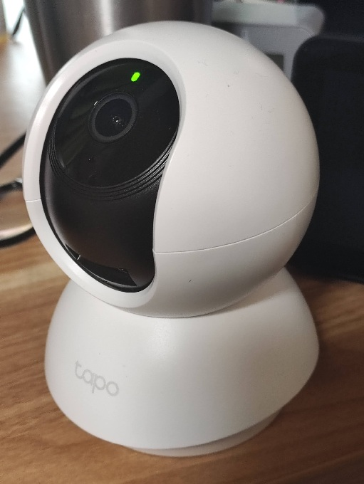

# Yatagarasu

Tapo見守りカメラ（TC70/C200/C220等）をロボット化するためのローカル実行プロジェクトです。  
音声認識（`listend.py`）・発話（`zunda` + `tapovoice`）・カメラ連携（go2rtc）・記憶（SemanticMemory）・SBERTによる軽量Intent判定を組み合わせて動作します。

## Demo
   
[Demo Video](https://tanep.work/yatagarasu/demo/yatagarasu_demo.mp4)  
> ブラウザで直接再生されない場合はリンク先を開いてください。

## なぜ Yatagarasu（八咫烏）なのか

八咫烏は、天照大神の使いとして「導き」の象徴とされる存在です。  
このプロジェクト名には、急速に進化するAIをロボットへ融合し、実世界へ導くという意図を込めています。

また、Tapoカメラが持つ以下の3要素を、八咫烏の3本の足になぞらえています。

- CCD（目）
- マイク（耳）
- スピーカー（口）

## 構成概要

- user systemd
  - `go2rtc`（カメラ中継）
  - `listend.py`（常時リッスン / wake-stop / SBERT Skill Router / dispatch）
- host service
  - `Ollama`（SemanticMemory要約用）
- Docker
  - `voicevox_engine`
  - `SemanticMemory`
  - `searxng`（`tanechan-search` 用）

SemanticMemoryはCPU専用PyTorchで動作します。Yatagarasu固有のCompose設定は
`deploy/semanticmemory.compose.override.yml`に分離し、submodule本体へ運用設定を
書き込まない構成です。埋め込みモデル変更時は保存済みベクトルの再構築が必要です。

### SemanticMemoryのRuri v3対応

新規Docker環境では、SemanticMemoryの埋め込みモデルにRuri v3を使用します。
既存の記憶を持つ環境ではRuri v2の設定を維持し、通常のアップデートだけで
モデルや検索ベクトルが自動的に変更されることはありません。

既存環境でRuri v3を利用する場合だけ、一度移行手順を実行します。詳しくは
[SemanticMemory Ruri v3 移行ガイド](docs/semanticmemory-ruri-v3-migration.md)を
参照してください。

## SBERT Skill Router

`YATAGARASU_SBERT_ROUTER_ENABLED="true"` の場合、`listend.py` はLLMへ渡す前に短いIntent判定を行います。
対象は、反射的に実行したい `move-camera`、撮影してLLMへ渡す `view`、明示的な過去記憶検索の `recall` です。

- `move-camera`: 右/左は45度、上/下は30度、キャリブレーションに対応。移動だけで完結する場合はLLMを呼ばず、発話もしません。
- `view`: go2rtcのHTTP frame APIを優先して画像を取得し、撮影画像の絶対パスをLLMプロンプトへ渡します。
- `recall`: SemanticMemoryから思い出した内容をLLMプロンプトへ追加します。
- `search` / `fetch` / `memorize` / `skill-creator`: 従来どおりAIエージェント側のSkillに任せます。

主な設定:

```bash
YATAGARASU_SBERT_ROUTER_ENABLED="false"
YATAGARASU_SBERT_DRY_RUN="true"
YATAGARASU_SBERT_MODEL="cl-nagoya/ruri-v3-70m"
YATAGARASU_SBERT_DEVICE="cpu"
YATAGARASU_SBERT_MOVE_SETTLE_SEC="1.0"
GO2RTC_FRAME_API_ENABLED="true"
```

初回はモデル取得が必要です。運用で安定した後は `YATAGARASU_SBERT_OFFLINE="true"` にすると、キャッシュ済みモデルだけを使います。

## ウェイクワード

標準設定では、専用ONNXモデルが「ねぇ、ヤタガラス」を検出します。
OFF状態でSTTを常時実行しないため、従来の文字列ウェイクより軽く、認識表記にも依存しません。
検出後は同梱済みの「はい」を再生してから命令音声を受け付けます。

```bash
LISTEND_WAKE_BACKEND="livekit"
LISTEND_WAKE_THRESHOLD="0.65"
LISTEND_WAKE_EARLY_THRESHOLD="0.15"
LISTEND_WAKE_EARLY_CONSECUTIVE="3"
LISTEND_WAKE_WARMUP_SEC="0.0"
LISTEND_WAKE_ACTIVE_INTERVAL_SEC="0.08"
LISTEND_WAKE_IDLE_INTERVAL_SEC="1.5"
LISTEND_WAKE_ACTIVITY_RMS_DBFS="-50"
LISTEND_WAKE_SPEECH_HOLD_SEC="2.0"
LISTEND_WAKE_LOOKAHEAD_MODE="active"
LISTEND_WAKE_LOOKAHEAD_TARGET_SEC="2.0"
LISTEND_WAKE_LOOKAHEAD_MAX_SILENCE_SEC="1.5"
LISTEND_WAKE_LOOKAHEAD_SILENCE_CHUNKS="2"
LISTEND_WAKE_LOOKAHEAD_TRIGGER_SCORE="0.10"
LISTEND_WAKE_LOOKAHEAD_THRESHOLD="0.55"
LISTEND_WAKE_PROMPT_GUARD_SEC="0.8"
LISTEND_WAKE_PROMPT_TIMEOUT_SEC="2.0"
```

VADが発話終了を確認すると、発話開始からの音声サンプル数を基準に、
2秒窓の不足分を仮想無音で補完して即時判定します。実時間で2秒経過するまで
待たないため、第8世代Core i7の実機試験では5回中5回を先読み検出し、
呼びかけ開始から「はい」の送信完了まで平均約1.50秒でした。

従来方式へ戻す場合は`LISTEND_WAKE_BACKEND="stt"`を指定します。
STT方式では、ウェイク語と命令を「マイカメラ、右を向いて」のように一息で発話します。
`LISTEND_WAKE_WORDS`はASCIIカンマで語句を区切り、日本語読点は語句の一部として扱います。
ONNX方式のウェイク語は`.env`の文字列変更では変わりません。別のウェイク語には
対応するONNXモデルが必要です。

同梱モデルは音響的に近い呼びかけを誤検出する場合があります。実機では
「ねぇ、カメラくん」と「ねぇ、山田くん」が通常判定を通過しました。
閾値だけでは正例と分離できず、応答速度を維持するためSTTによる二段階確認も
行いません。これは同梱ONNXモデルの既知の制約です。

ウェイク検出時の応答音声には、VOICEVOXで生成した青山龍星の音声を使用しています。

`VOICEVOX:青山龍星`

第8世代Core i7でのCPU測定結果と実機受入結果は
[LiveKit WakeWord試験結果](docs/plan/livekit-wakeword-test-results.md)を参照してください。

## LLM実行基盤（Codex CLI / Claude Code / opencode）

`bin/yatagarasu` は内部でAIエージェントCLIを呼び出します。  
現在は **Codex CLI (`codex`)**、**Claude Code CLI (`claude`)**、**opencode (`opencode`)** に対応しています。

`.env` の `YATAGARASU_ENGINE` で実行エンジンを選択できます。

```bash
YATAGARASU_ENGINE="auto"    # auto / codex / claude / opencode
YATAGARASU_MODEL=""         # Codexでは空ならCodex CLI設定を使用
YATAGARASU_CODEX_MODEL=""   # Codex専用モデル指定
YATAGARASU_CODEX_PROFILE="" # Codex Profile名
YATAGARASU_CODEX_REASONING_EFFORT="" # low / medium / high / xhigh
YATAGARASU_CODEX_BYPASS_SANDBOX="false" # 対話利用の安全な既定値
```

HoshikageをCodexのローカル推論Providerとして使う場合は、Hoshikageが生成した対話用Profileを`$CODEX_HOME/<profile>.config.toml`へ配置し、`workspace/.env`でProfile、モデル、Tokenを選びます。

```bash
YATAGARASU_ENGINE="codex"
YATAGARASU_CODEX_PROFILE="yatagarasu-local"
YATAGARASU_CODEX_MODEL="unsloth-gemma4-12b-qat-thinking-off"
HOSHIKAGE_API_KEY="<hoshikage token listで確認したToken>"
YATAGARASU_CODEX_BYPASS_SANDBOX="false"
```

`HOSHIKAGE_API_KEY`はLAN認証用の秘密情報です。ProfileやGit管理ファイルへ書かず、Git管理外の`workspace/.env`からCodex子プロセスへ渡します。設定後は`bin/yatagarasu doctor --no-services --no-logs`でProfile、Token設定、Hoshikage readinessを確認できます。

Search、Fetch、RecallなどをCodex sandbox内で実行するため、Hoshikageが生成するProfileには`[sandbox_workspace_write] network_access = true`が含まれます。Doctorはこの設定も検証します。手動確認でSkillを使う場合は`workspace`を作業directoryにします。

稼働中に`workspace/.env`を変更した場合は、`systemctl --user restart yatagarasu.service`で音声serviceへ新設定を読み込ませます。

確認コマンド:

```bash
codex --version
cd workspace
codex exec --profile yatagarasu-local "Return exactly OK."
```

Claude Codeを使う場合:

```bash
YATAGARASU_ENGINE="claude"
YATAGARASU_MODEL="haiku"
claude --version
claude -p "hello" --model haiku
```

## セットアップ

セットアップ手順は [docs/setup-manual.md](docs/setup-manual.md) に集約しています。  
以下の順で進めてください。

1. 前提条件の確認
2. Codex CLI（`codex`）またはClaude Code CLI（`claude`）導入・認証確認
3. `.env` 設定
4. `go2rtc`（user systemd）起動
5. `Ollama`（host）導入・モデル取得
6. Dockerサービス（`voicevox_engine` / `SemanticMemory` / `searxng`）起動
7. `listend.py`（user systemd）起動
8. 必要に応じてSBERT Skill Routerをdry-runから有効化

## 診断

実行環境の状態確認には `doctor` サブコマンドを使います。

```bash
bin/yatagarasu doctor
bin/yatagarasu doctor --verbose
```

確認対象:
- `.env` 読み込みとGit除外状態
- Codex CLI / Claude Code / opencode
- VOICEVOX / go2rtc
- `zunda` / `tapovoice` / `ffmpeg`
- LiveKit WakeWord / ONNXモデル / CPU Provider / prompt音声
- `yatagarasu.service` / `go2rtc.service`
- 直近ログのエラー傾向

## 実運用設定の扱い

`workspace/.env` はカメラ認証情報や実運用モデルなどの固有設定を含むため、Git管理しません。
共有・更新する設定キーは `workspace/.env.example` に追加し、実値は各環境の `workspace/.env` に反映します。

運用環境で更新する前には、必要に応じて以下のように退避してください。

```bash
cp workspace/.env workspace/.env.local.backup
git pull --ff-only
```

## ライセンス

本リポジトリ（`yatagarasu` 本体）のライセンスは **MIT** です。  
詳細は `LICENSE` を参照してください。

## 第三者ソフトウェアとライセンス

このプロジェクトは第三者ソフトウェアを利用します。各ソフトウェアはそれぞれのライセンスに従います。

| コンポーネント | 用途 | ライセンス（上流） | 参照 |
|---|---|---|---|
| go2rtc | RTSP/双方向音声中継 | MIT | https://github.com/AlexxIT/go2rtc |
| VOICEVOX ENGINE | TTSエンジン | LGPL-3.0（上流READMEでデュアルライセンス説明あり） | https://github.com/VOICEVOX/voicevox_engine |
| SearXNG | 検索エンジン | AGPL-3.0-or-later | https://github.com/searxng/searxng |
| SemanticMemory（submodule） | 記憶API | MIT | `external/SemanticMemory/LICENSE` |
| ReazonSpeech（submodule） | STT実装 | Apache-2.0 | `external/ReazonSpeech/LICENSE` |
| faster-whisper | STTライブラリ | MIT | https://github.com/SYSTRAN/faster-whisper |
| silero-vad | VAD | MIT | https://github.com/snakers4/silero-vad |
| onvif-zeep | ONVIF制御 | MIT | https://github.com/FalkTannhaeuser/python-onvif-zeep |
| PyTorch | 推論基盤 | BSD-3-Clause | https://pypi.org/project/torch/ |
| NumPy | 数値計算 | BSD系（PyPI表記参照） | https://pypi.org/project/numpy/ |
| sentence-transformers | SBERT Skill Router | Apache-2.0 | https://github.com/UKPLab/sentence-transformers |
| Transformers | SBERT Skill Router | Apache-2.0 | https://github.com/huggingface/transformers |
| SentencePiece | Ruri v3 tokenizer | Apache-2.0 | https://github.com/google/sentencepiece |
| LiveKit WakeWord | ONNXウェイクワード推論 | Apache-2.0 | https://github.com/livekit/livekit-wakeword |
| VoxCPM | ウェイクワード学習用合成音声 | Apache-2.0 | https://github.com/OpenBMB/VoxCPM |

## 使用モデルとライセンス

| モデル | 主な利用箇所 | ライセンス（上流表記） | 参照 |
|---|---|---|---|
| `Systran/faster-whisper-base` | `LISTEND_STT_BACKEND=faster-whisper` | MIT | https://huggingface.co/Systran/faster-whisper-base |
| `reazon-research/reazonspeech-k2-v2` | `LISTEND_STT_BACKEND=reazonspeech-k2` | Apache-2.0 | https://huggingface.co/reazon-research/reazonspeech-k2-v2 |
| `cl-nagoya/ruri-small-v2` | SemanticMemory埋め込み（移行前） | Apache-2.0 | https://huggingface.co/cl-nagoya/ruri-small-v2 |
| `cl-nagoya/ruri-v3-70m` | SBERT Skill Router / SemanticMemory移行候補 | Apache-2.0 | https://huggingface.co/cl-nagoya/ruri-v3-70m |
| `SakanaAI/TinySwallow-1.5B-Instruct-GGUF` | SemanticMemory要約 | Apache-2.0 + Gemma Terms（SemanticMemory README記載） | https://huggingface.co/SakanaAI/TinySwallow-1.5B-Instruct-GGUF |
| `nee_yatagarasu.onnx` | 「ねぇ、ヤタガラス」検出 | Apache-2.0 / Tane Channel Technology | `models/wakeword/README.md` |

補足:

- モデル重み・音声ライブラリは本リポジトリに同梱していないものが含まれます。
- 実運用時に取得するモデル/音声ライブラリの最新規約を必ず確認してください。
- 同梱のウェイク応答音声を利用・再配布する場合は
  `VOICEVOX:青山龍星`のクレジットを表示し、VOICEVOXと青山龍星の規約に従ってください。

## 配布とコンプライアンス

本リポジトリの公開・再配布にあたっては、以下を遵守してください。

1. 本体ライセンス（MIT、`LICENSE`）を保持する。
2. 第三者コンポーネントのライセンス表示・著作権表示を保持する。
3. AGPL（SearXNG）を改変して配布または公開運用する場合は、AGPLの義務（対応ソース提供等）を満たす。
4. LGPL（VOICEVOX ENGINE）を改変して再配布する場合は、LGPLの義務を満たす。
5. 利用するモデルの規約（Hugging Face model card / Gemma Terms 等）を遵守する。

## 法的注意

本READMEのライセンス整理は情報提供を目的とした要約です。  
法的助言ではないため、商用利用・大規模公開・再配布時は必要に応じて専門家に確認してください。
