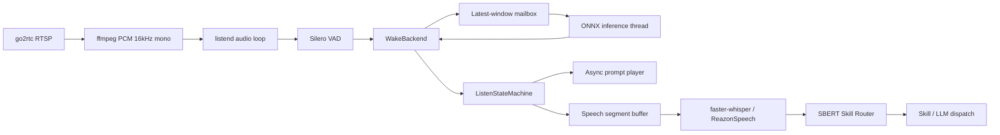
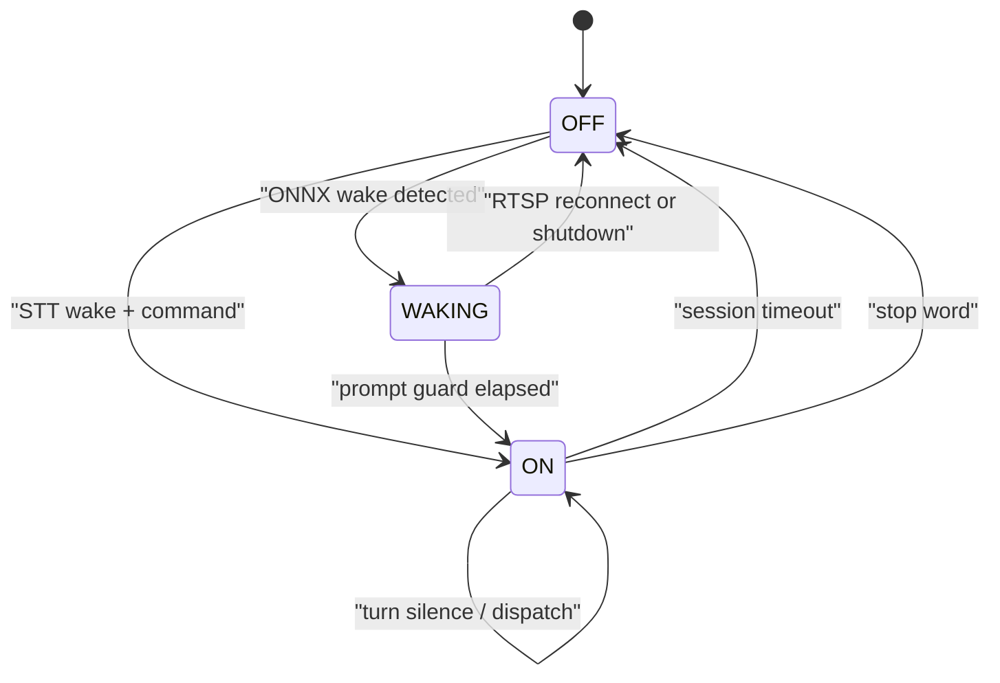

# LiveKit WakeWord対応 システム設計 v0.1

- 作成日: 2026-07-27
- 対象要件: `docs/plan/livekit-wakeword-requirements.md` v0.3
- 対象実装: `python/listend.py` とウェイクワード関連モジュール
- 既定バックエンド: `livekit`
- 互換バックエンド: `stt`

## 1. 設計目的

専用ONNXモデルで「ねぇ、ヤタガラス」を低負荷に検出し、既存のRTSP入力、
Silero VAD、STT、SBERT Skill Router、LLM dispatchを壊さず接続する。

実装は次の原則に従う。

- `listend.py`へバックエンド固有の分岐を散在させない。
- 音声入力、ONNX推論、状態遷移、フィードバック再生の所有者を分離する。
- RTSP読込loopでは、ONNX推論とフィードバック再生の完了を待たない。
- タイマー判定は純粋な状態機械へ集約する。
- 境界は`Protocol`で表現し、実機なしの単体テストへ差し替え可能にする。
- 推論要求は「古い順に処理」せず、常に最新の音声窓を優先する。

## 2. 既存実装の維持範囲

初期実装では、次の既存構造を維持する。

- RTSP取得とffmpeg再接続
- 16kHz / mono / signed 16-bit PCM
- 80msの基本チャンク
- Silero VAD
- faster-whisper / ReazonSpeech k2切替
- ON状態の発話セグメント確定
- SBERT Skill Router
- `LISTEND_WAKE_ACK_WORD`のLLM dispatch直前再生
- PTZ workerとAI dispatch

STTモデルは従来どおりservice起動時にロードする。ON遷移後の遅延を避け、
今回の変更範囲をウェイク経路へ限定するため、遅延ロードは行わない。

## 3. 既存実装で解消する問題

### 3.1 空セッションの即時終了

現行`_handle_on_silence()`は、セッションテキストが空の場合に
`LISTEND_SILENCE_TIMEOUT_SEC`を待たず`OFF`へ戻る。

状態機械へタイマー判定を移し、`ON`遷移時刻から3秒待つ。

### 3.2 ターン確定直後のOFF遷移

`LISTEND_SESSION_END_SILENCE_SEC`と`LISTEND_SILENCE_TIMEOUT_SEC`を
ともに3秒へすると、同じtick内でdispatchとOFF遷移が連続する可能性がある。

1回のtickが返すactionを1つに制限し、優先順位を次のように固定する。

1. 認識済みテキストあり + ターン終端 -> `DISPATCH`
2. 認識済みテキストなし + セッション無活動 -> `ENTER_OFF`

dispatch完了後に無活動タイマーをリセットする。

### 3.3 常時ONNX推論

LiveKitの`WakeWordModel.predict()`はstatelessであり、呼び出しごとに約2秒の
音声窓全体からmel spectrogramとspeech embeddingを再計算する。
Yatagarasuでは連続する音声窓の重複をPCMサンプル単位で検証し、直前と同一の
speech embeddingを再利用する。80ms更新時は16個中15個を再利用し、新しい1個だけを
計算する。音声が不連続、窓サイズが変化、または重複を確認できない場合は、
キャッシュを使用せず全件を再計算する。mel spectrogramとclassifierは毎回計算し、
推論スコアの意味および判定閾値は変更しない。

Silero VADに連動した推論間隔を採用し、active推論は発話中だけに限定する。

- 発話開始時: 即時要求
- 発話中: 80ms間隔
- 待機中: 1.5秒間隔
- 発話検出後: 2秒間は発話中intervalを維持

発話開始はSilero VADを主判定とし、VADが短い呼びかけを逃した場合に限って
RMS音量gateを補助判定として使用する。補助判定はschedulerへのactive通知だけに
作用し、命令録音とSTTのVAD状態には作用しない。

無音先読みは`LISTEND_WAKE_LOOKAHEAD_MODE=active`を標準とする。
音声活動終了後、設定した連続無音チャンクを確認した時点で、現在の2秒窓を前へずらし、
末尾へ不足分の仮想無音を追加して即時判定する。

補完量は壁時計ではなく16kHz音声のサンプル数から算出する。

```text
observed_samples =
  VAD発話開始チャンク先頭から無音確定チャンク末尾までのsample数

silence_samples = clamp(
  target_samples - observed_samples,
  0,
  max_silence_samples
)
```

VAD起点は補完済み窓のscoreがlookahead threshold以上なら検出する。
VADなしで通常scoreの上昇から先読みする場合だけ、現在scoreがtrigger threshold以上、
かつ補完scoreがlookahead threshold以上という二重条件を適用する。
`shadow`は補完scoreと将来の通常scoreを比較する診断用途として維持する。

VAD補完要求は通常推論要求より優先してpendingへ保持する。未受領のVAD補完結果も
通常推論結果では上書きしない。同じgenerationの新しい補完要求は古い補完要求を
置き換え、generation変更後の要求は常に古い要求を置き換える。

上流実装:

- https://github.com/livekit/livekit-wakeword/blob/main/src/livekit/wakeword/inference/model.py

### 3.4 blocking処理による音声欠落

ONNX推論とフィードバック再生をRTSP読込loopから分離する。

- ONNX推論: 専用thread 1本
- 「はい」再生: 非同期`subprocess.Popen`
- RTSP読込: 現行main thread

STTとAI dispatchの非同期化は今回の対象外とする。

## 4. モジュール構成

| ファイル | 責務 |
|---|---|
| `python/listend.py` | RTSP、VAD、STT、各コンポーネントのオーケストレーション |
| `python/wakeword.py` | Wake backend interface、LiveKit/STT実装、音声窓、scheduler、推論worker |
| `python/listen_state.py` | `OFF / WAKING / ON`と無音タイマーの純粋な状態機械 |
| `python/audio_prompt.py` | 同梱音声を`tapovoice`へ渡す非同期player |
| `python/tests/test_wakeword.py` | 音声窓、scheduler、worker、backendの単体テスト |
| `python/tests/test_listen_state.py` | 状態遷移とタイマーの単体テスト |
| `python/tests/test_audio_prompt.py` | prompt process管理の単体テスト |
| `python/tests/test_listend_wake_flow.py` | backend別の結合テスト |

`WakeBackend`と`PromptPlayer`は複数実装またはtest doubleが必要な境界にだけ置く。
リングバッファやschedulerは具象型とし、不要なinterface階層を作らない。

## 5. 全体構成



データ所有権:

- PCMチャンクの原本はmain threadが所有する。
- 推論要求時だけ連続した`numpy.int16`配列へcopyする。
- 推論workerへ渡した配列はimmutableとして扱う。
- 状態機械は時刻と状態だけを所有し、音声やsubprocessを所有しない。

## 6. 型とinterface

### 6.1 共通データ型

`python/wakeword.py`へ次を定義する。

```python
from dataclasses import dataclass
from typing import Protocol

import numpy as np
from numpy.typing import NDArray


@dataclass(frozen=True)
class WakeDetection:
    backend: str
    name: str
    score: float
    detected_at: float
    inference_elapsed_sec: float


@dataclass(frozen=True)
class WakeBackendHealth:
    healthy: bool
    inference_count: int
    dropped_request_count: int
    last_error: str | None


class WakeBackendFatalError(RuntimeError):
    pass


class WakeBackend(Protocol):
    name: str
    requires_off_transcription: bool

    def start(self) -> None: ...

    def accept_audio(
        self,
        pcm: NDArray[np.int16],
        *,
        has_speech: bool,
        now: float,
    ) -> None: ...

    def accept_transcription(
        self,
        text: str,
        *,
        now: float,
    ) -> WakeDetection | None: ...

    def poll(self, *, now: float) -> tuple[WakeDetection, ...]: ...

    def reset_audio(self) -> None: ...

    def health(self) -> WakeBackendHealth: ...

    def close(self) -> None: ...
```

`accept_audio()`と`poll()`はmain threadからだけ呼ぶ。
`WakeBackend`実装の公開methodはブロックしない。
workerで回復不能な例外が発生した場合、`poll()`は`WakeBackendFatalError`を送出する。

### 6.2 状態機械

`python/listen_state.py`へ次を定義する。

```python
from dataclasses import dataclass
from enum import Enum


class ListenState(str, Enum):
    OFF = "OFF"
    WAKING = "WAKING"
    ON = "ON"


class SessionAction(str, Enum):
    NONE = "NONE"
    START_PROMPT = "START_PROMPT"
    ENTER_ON = "ENTER_ON"
    DISPATCH = "DISPATCH"
    ENTER_OFF = "ENTER_OFF"


@dataclass
class ListenStateMachine:
    state: ListenState
    prompt_guard_sec: float
    session_end_silence_sec: float
    silence_timeout_sec: float
    state_entered_at: float
    last_activity_at: float

    def on_livekit_wake(self, now: float) -> SessionAction: ...
    def on_stt_wake(self, now: float) -> SessionAction: ...
    def voice_detected(self, now: float) -> None: ...
    def stop_detected(self, now: float) -> SessionAction: ...
    def dispatch_completed(self, now: float) -> None: ...
    def tick(self, now: float, *, has_pending_text: bool) -> SessionAction: ...
```

状態の書換えはこのclassだけが行う。`listend.py`は返されたactionに従って
副作用を実行する。LiveKitとSTTの遷移差をboolean引数で表現せず、
異なる入力eventとして公開する。

### 6.3 prompt player

`python/audio_prompt.py`へ次を定義する。

```python
class PromptStatus(str, Enum):
    IDLE = "IDLE"
    RUNNING = "RUNNING"
    SUCCEEDED = "SUCCEEDED"
    FAILED = "FAILED"
    TIMED_OUT = "TIMED_OUT"


class PromptPlayer(Protocol):
    def start(self, audio_path: Path, *, now: float) -> None: ...
    def poll(self, *, now: float) -> PromptStatus: ...
    def close(self) -> None: ...
```

具象型`TapovoiceFilePromptPlayer`は
`[tapovoice, "-i", absolute_audio_path]`を`Popen`し、main loopでは`poll()`だけ行う。
process timeoutにはprompt専用の`LISTEND_WAKE_PROMPT_TIMEOUT_SEC`を使用する。
通常時はprocess終了を検知した時点で次へ進み、設定時間を常に待つものではない。
timeoutは`tapovoice`またはgo2rtcへの送信処理が終了しない場合の上限である。

## 7. Wake backend設計

### 7.1 backend factory

```python
def create_wake_backend(
    settings: WakeSettings,
    *,
    text_matcher: Callable[[str], tuple[bool, str | None]],
    clock: Callable[[], float] = time.monotonic,
) -> WakeBackend:
    factories = {
        "livekit": lambda: LiveKitWakeBackend(settings, clock=clock),
        "stt": lambda: SttWakeBackend(text_matcher),
    }
    return factories[settings.backend]()
```

不明なbackendは設定読込時に拒否するため、factoryで黙ってfallbackしない。

### 7.2 STT互換backend

`SttWakeBackend`は次の特性を持つ。

- `requires_off_transcription=True`
- `accept_audio()`はno-op
- `poll()`は空tuple
- `accept_transcription()`で既存の表記正規化と`LISTEND_WAKE_WORDS`判定を行う
- STTウェイク時は従来どおり、wake語と命令を含む同一セグメントを処理する
- wake語だけのセグメントをdispatchしない現行互換を維持する
- ONNXモデル、worker、prompt MP3を必要としない

STT backend選択時は`OFF`でも発話セグメントを構築してSTTへ渡す。

### 7.3 LiveKit backend

`LiveKitWakeBackend`は次を合成する。

- `WakeWordModel`
- `AudioWindow`
- `AdaptiveInferenceScheduler`
- `LatestWindowWorker`
- threshold / debounce判定

特性:

- `requires_off_transcription=False`
- `accept_transcription()`は常に`None`
- `WakeWordModel`はmain threadで初期化し、`predict()`はworker threadだけが呼ぶ
- score判定とdebounce更新はmain threadの`poll()`で行う
- threshold未満の結果もDEBUG計測には残す

## 8. AudioWindow

### 8.1 仕様

- sample rate: 16000Hz固定
- dtype: `numpy.int16`
- window: 32000 samples
- reset時は32000 samplesをzeroで初期化する
- 入力: 80ms、1280 samplesを標準とする
- 内部表現: `collections.deque[NDArray[np.int16]]`
- 実音声の保持sample数を`real_sample_count`で別途管理する
- appendした実音声と同じsample数だけ先頭のzeroまたは古い音声を捨てる
- snapshot時だけ`np.concatenate()`を行う

### 8.2 invariant

- 保持sample数は常に32000
- `0 <= real_sample_count <= 32000`
- snapshotは常に正確に32000 samples
- 入力配列への参照を保持せず、append時にcopyする
- `reset()`後は全sampleがzeroで、`real_sample_count == 0`

schedulerは`real_sample_count > 0`かつ
`real_sample_count >= warmup_sec * 16000`の場合だけ推論要求を発行する。
既定のwarmupは0.0秒であり、reset後の最初の実音声チャンクから推論できる。
モデル入力はwarmup設定にかかわらず常に32000 samplesとする。

## 9. AdaptiveInferenceScheduler

### 9.1 状態

- `last_inference_requested_at`
- `last_speech_at`
- `was_voice_recent`
- `active_interval_sec`
- `idle_interval_sec`
- `speech_hold_sec`

### 9.2 判定

```python
def should_request(self, *, has_speech: bool, now: float) -> bool:
    if has_speech:
        self.last_speech_at = now

    voice_recent = now - self.last_speech_at <= self.speech_hold_sec
    speech_started = voice_recent and not self.was_voice_recent
    self.was_voice_recent = voice_recent

    interval = (
        self.active_interval_sec
        if voice_recent
        else self.idle_interval_sec
    )
    due = now - self.last_inference_requested_at >= interval

    if speech_started or due:
        self.last_inference_requested_at = now
        return True
    return False
```

起動直後は`last_speech_at`を負の無限相当として扱い、無音を発話中と誤認しない。
AudioWindowが満たされていない場合はsnapshotを作らず、推論時刻も更新しない。

### 9.3 VAD利用

- 既存`_has_speech()`の結果をそのまま渡す。
- RMS gateは初期実装へ追加しない。
- Silero VAD失敗時の既存fallback結果も同じように扱う。
- VADが小声を見逃しても、待機中1秒間隔の推論は継続する。

## 10. LatestWindowWorker

### 10.1 mailbox

workerは次だけを保持する。

```python
@dataclass(frozen=True)
class InferenceRequest:
    generation: int
    sequence: int
    submitted_at: float
    audio: NDArray[np.int16]


@dataclass(frozen=True)
class InferenceResult:
    generation: int
    sequence: int
    submitted_at: float
    completed_at: float
    scores: dict[str, float]
    error: str | None
```

- 実行中: 最大1件
- pending: 最大1件
- 新要求受付時にpendingが存在すれば、新要求で置換してdrop件数を加算
- result queueは小さい固定長とし、main threadが毎チャンクdrainする
- `queue.Queue`へ要求を無制限に積まない

### 10.2 generation

RTSP再接続、状態遷移、suppression開始時はgenerationを増やす。

- reset前に実行中だった推論は停止できない
- 完了resultのgenerationが現行と違う場合は破棄する
- 古い音声による遅延ウェイクを防止する

### 10.3 thread lifecycle

- `start()`でdaemon threadを1本起動
- worker loopは`threading.Condition`でpending要求を待つ
- `close()`でstop flagを立て、最大2秒joinする
- join timeout時は警告を出す
- `predict()`例外は`InferenceResult.error`としてmain threadへ返す
- 最初の推論例外をbackend fatal errorとし、以後の要求受付を停止する

同じ`WakeWordModel`を複数threadから呼ばない。

## 11. 状態機械

### 11.1 遷移



### 11.2 OFF

LiveKit backend:

1. 全PCMチャンクをAudioWindowへ追加
2. VAD結果からschedulerを更新
3. 必要時だけsnapshotをworkerへsubmit
4. resultをpoll
5. threshold以上かつdebounce外なら`on_livekit_wake()`を呼び`WAKING`
6. OFF状態では発話segmentを構築せずSTTを呼ばない

STT backend:

1. 従来どおりVAD segmentを構築
2. segment終端でSTT
3. wake語と命令が同一segmentにあれば`on_stt_wake()`を呼び`ON`

### 11.3 WAKING

1. state entryでsegment bufferとONNX AudioWindowをzero reset
2. 同梱MP3をprompt playerへ渡す
3. `prompt_timeout_deadline = now + prompt_timeout_sec`
4. RTSP音声は読み続ける
5. PCMは命令segmentにもONNX AudioWindowにも追加しない
6. 共通housekeepingがprompt processの成否をpollしてログへ出す
7. 送信成功時は`prompt_guard_deadline = now + guard_sec`を設定する
8. guard到達時に`ON`
9. 送信失敗またはtimeout時は、prompt guardを待たず`ON`
10. ON entryでVAD segmentと命令sessionを初期化

prompt processは通常、音声をgo2rtcへ登録した時点で終了する。実際のカメラ再生完了は
取得できないため、回り込み抑制は`LISTEND_WAKE_PROMPT_GUARD_SEC`で実機調整する。
`LISTEND_WAKE_PROMPT_TIMEOUT_SEC`は「はい」の再生時間や利用者の発話待ち時間ではなく、
送信subprocessが停止しない場合のfail-open上限である。

### 11.4 ON

1. VAD有音時に`voice_detected(now)`
2. segment終端でSTT
3. stop語なら`OFF`
4. 通常テキストはsessionへ追加
5. state machineの`tick()`が`DISPATCH`を返したら1ターンdispatch
6. dispatch成功・失敗・Router完結のいずれでも`OFF`へ遷移
7. システム音声を再生した場合は、RTSP audio consumerを待ち時間なしで再起動し、
   dispatch中に蓄積した自己音声を破棄
8. Routerだけで完結して音声を再生しない場合はconsumerを維持

## 12. listend.py統合

### 12.1 constructor injection

```python
class ListendService:
    def __init__(
        self,
        settings: ListendSettings,
        *,
        wake_backend: WakeBackend | None = None,
        prompt_player: PromptPlayer | None = None,
        clock: Callable[[], float] = time.monotonic,
    ) -> None:
        ...
```

productionではfactoryを使用し、テストではfakeを注入する。

### 12.2 state handler table

`_process_chunk()`の状態分岐はhandler tableへ集約する。

```python
self._chunk_handlers = {
    ListenState.OFF: self._handle_off_chunk,
    ListenState.WAKING: self._handle_waking_chunk,
    ListenState.ON: self._handle_on_chunk,
}
```

共通処理:

1. bytesから`numpy.int16` viewを作る
2. Silero VADを1回だけ実行
3. 対応state handlerを呼ぶ
4. prompt playerをpollし、終了・失敗・timeoutを回収する
5. wake workerのfatal errorを確認する

状態固有処理を巨大な`if/elif`へ追加しない。

### 12.3 segment helper

既存のsegment状態を次のprivate methodへ閉じ込める。

- `_feed_segment(chunk, has_speech, now)`
- `_reset_segment()`
- `_finalize_segment()`

OFF/livekitとWAKINGでは`_feed_segment()`を呼ばない。
OFF/sttとONだけが呼ぶ。

### 12.4 state entry

状態機械から返されたactionの副作用は`_apply_session_action()`へ集約する。

| action | 副作用 |
|---|---|
| `START_PROMPT` | segment/session reset、wake backend audio reset、prompt start |
| `ENTER_ON` | segment/session reset、ON無活動timer開始 |
| `DISPATCH` | session dispatch、完了後にstate machineのtimer reset |
| `ENTER_OFF` | segment/session reset、wake backend audio reset |

standby音声はstop wordによる`OFF`遷移時だけ再生する。無音キャンセルでは再生しない。

## 13. 自己発話抑制

ONNX backendでは`LISTEND_WAKE_SUPPRESSION_SEC`を次のように適用する。

- `LISTEND_WAKE_ACK_WORD`またはAI応答の再生完了時刻を`last_system_audio_at`として記録
- `OFF`で`now < last_system_audio_at + wake_suppression_sec`なら推論要求を発行しない
- suppression中はAudioWindowをzero reset状態に保つ
- suppression終了後は実音声を追加し、不足する過去音声をzeroで補った2秒窓で推論する
- `LISTEND_WAKE_WARMUP_SEC`が0より大きい場合だけ、その秒数の実音声が
  蓄積するまで推論を抑制する

既存`last_wake_ack_at`は`last_system_audio_at`へ責務を明確化する。

「はい」はWAKING中にONNXが停止しているため、ONNX suppressionの対象外とする。

## 14. 設定設計

### 14.1 ListendSettings追加

```python
@dataclass(frozen=True)
class WakeSettings:
    backend: str
    model_path: Path
    threshold: float
    debounce_sec: float
    active_interval_sec: float
    idle_interval_sec: float
    speech_hold_sec: float
    warmup_sec: float
    prompt_audio_path: Path
    prompt_guard_sec: float
    prompt_timeout_sec: float
```

`ListendSettings`は`wake: WakeSettings`を持つ。ウェイク関連fieldを平坦に追加しない。

### 14.2 環境変数

| 環境変数 | 型 | 既定値 | 検証 |
|---|---:|---:|---|
| `LISTEND_WAKE_BACKEND` | str | `livekit` | `livekit / stt`のみ |
| `LISTEND_WAKE_MODEL_PATH` | path | 同梱ONNX | readable file |
| `LISTEND_WAKE_THRESHOLD` | float | `0.65` | `0.0 < value <= 1.0` |
| `LISTEND_WAKE_EARLY_THRESHOLD` | float | `0.15` | `0.0 < value <= threshold` |
| `LISTEND_WAKE_EARLY_CONSECUTIVE` | int | `3` | `>= 1` |
| `LISTEND_WAKE_DEBOUNCE_SEC` | float | `2.0` | `>= 0` |
| `LISTEND_WAKE_ACTIVE_INTERVAL_SEC` | float | `0.08` | `> 0` |
| `LISTEND_WAKE_IDLE_INTERVAL_SEC` | float | `1.5` | active以上 |
| `LISTEND_WAKE_ACTIVITY_RMS_DBFS` | float | `-50.0` | `-120.0 <= value <= 0.0` |
| `LISTEND_WAKE_SPEECH_HOLD_SEC` | float | `2.0` | `>= 0` |
| `LISTEND_WAKE_WARMUP_SEC` | float | `0.0` | `0.0 <= value <= 2.0` |
| `LISTEND_WAKE_LOOKAHEAD_MODE` | str | `active` | `off / shadow / active` |
| `LISTEND_WAKE_LOOKAHEAD_TARGET_SEC` | float | `2.0` | `0.08 <= value <= 2.0` |
| `LISTEND_WAKE_LOOKAHEAD_MAX_SILENCE_SEC` | float | `1.5` | `0.08 <= value <= 1.5` |
| `LISTEND_WAKE_LOOKAHEAD_SILENCE_CHUNKS` | int | `2` | `>= 1` |
| `LISTEND_WAKE_LOOKAHEAD_TRIGGER_SCORE` | float | `0.10` | `0.0 < value <= threshold` |
| `LISTEND_WAKE_LOOKAHEAD_THRESHOLD` | float | `0.55` | `0.0 < value <= 1.0` |
| `LISTEND_WAKE_PROMPT_AUDIO` | path | 同梱MP3 | readable file |
| `LISTEND_WAKE_PROMPT_GUARD_SEC` | float | `0.8` | `>= 0` |
| `LISTEND_WAKE_PROMPT_TIMEOUT_SEC` | float | `2.0` | `> 0` |
| `LISTEND_SESSION_END_SILENCE_SEC` | float | `3.0` | `> 0` |
| `LISTEND_SILENCE_TIMEOUT_SEC` | float | `3.0` | `> 0` |
| `LISTEND_RTSP_LOW_LATENCY` | bool | `true` | true / false |

新規設定は不正値をwarning fallbackせず、起動エラーにする。
LiveKit backend選択時は`LISTEND_SAMPLE_RATE=16000`かつ
`LISTEND_CHANNELS=1`も必須とし、不一致なら起動エラーにする。

### 14.3 path解決

- 空文字:
  - model: `<project_root>/models/wakeword/nee_yatagarasu.onnx`
  - prompt: `<project_root>/assets/audio/wake_prompt_hai.mp3`
- 絶対path: そのまま使用
- 相対path: `YATAGARASU_CWD`から解決

STT backendではmodelとpromptの存在を起動必須条件にしない。

### 14.4 既存設定

- `LISTEND_WAKE_WORDS`
  - STT backendでは必須
  - LiveKit backendでは表示用の任意設定
- `LISTEND_WAKE_PROMPT_WORD`
  - 互換性のため読込を残す
  - LiveKit backendの即時feedbackには使用せず、同梱音声を使用する
- `LISTEND_WAKE_ACK_WORD`
  - 既存どおりLLM dispatch直前だけ使用する
- `LISTEND_WAKE_ACK_SPEAKER_ID`
  - 空なら`SPEAKER_ID`
  - 新規標準設定は青山龍星`13`

## 15. dependencyとasset

### 15.1 Python dependency

`python/pyproject.toml`へ次を追加し、`python/uv.lock`を更新する。

```toml
"livekit-wakeword>=0.2.1,<0.3.0",
```

- `listener` extraは使用しない
- PyAudioとPortAudioを導入しない
- `livekit-wakeword`の通常依存であるCPU版`onnxruntime`を使用する
- `CPUExecutionProvider`以外を要求しない
- mel、speech embedding、classifierの各ONNX Sessionは
  intra-op / inter-opとも1 thread、sequential executionへ固定する
- training / eval / export extrasは導入しない

### 15.2 asset

| 取込元 | リポジトリ格納先 | mode |
|---|---|---:|
| 提供済み`nee_yatagarasu.onnx` | `models/wakeword/nee_yatagarasu.onnx` | `0644` |
| 提供済み`hai.mp3` | `assets/audio/wake_prompt_hai.mp3` | `0644` |

asset READMEへhash、用途、来歴、クレジットを記録する。
ONNXモデルについては、作成者を`Tane Channel Technology`とし、
LiveKit WakeWordのVoxCPM公式設定を使って録音音声を追加せず学習したこと、
作成者がApache License 2.0で配布することを記録する。

## 16. 起動・停止・再接続

### 16.1 起動順序

1. `.env`読込
2. 設定の構文・範囲検証
3. VAD/STT初期化
4. Wake backend生成
5. LiveKit model初期化
6. prompt player生成
7. SBERT Router / PTZ worker初期化
8. wake worker開始
9. ffmpeg接続

LiveKit初期化失敗時はexit code 2で終了し、STTへ自動fallbackしない。

### 16.2 RTSP再接続

- ffmpeg停止
- segment/sessionをreset
- stateを`OFF`へ戻す
- wake generationを更新
- AudioWindow、pending、未取得resultを破棄
- prompt processが実行中なら終了を要求
- wake worker自体とモデルは再利用する
- 新しいffmpeg接続を開始

### 16.3 shutdown

1. stop flag設定
2. ffmpeg停止
3. prompt process終了
4. wake worker close
5. PTZ worker停止

shutdown時の未dispatchテキストflushは既存挙動を維持する。

## 17. エラー設計

| エラー | 動作 |
|---|---|
| backend設定不正 | 起動失敗 |
| LiveKit import失敗 | 起動失敗 |
| model不存在・読取不可 | 起動失敗 |
| model session生成失敗 | 起動失敗 |
| ONNX推論例外 | fatalログ、service終了 |
| prompt asset不存在 | LiveKit選択時は起動失敗 |
| prompt subprocess起動失敗 | warning、guard後にON |
| prompt subprocess失敗・timeout | warning、guard後にON |
| RTSP切断 | 現行再接続 |
| STT失敗 | 現行どおり当該segmentを破棄 |
| dispatch失敗 | 現行どおりログ後に継続、timer reset |

ONNX fatal errorをRTSP再接続エラーとして扱わない。audio loopの広い
`except Exception`より外側へ`WakeBackendFatalError`を伝搬させ、無限再接続を防ぐ。

## 18. ログとmetrics

### 18.1 INFO

- `wake_backend`
- model絶対path
- model名
- threshold / debounce
- active / idle interval / speech hold
- prompt絶対path / guard
- Provider
- wake検出score
- wake trace ID
- activity開始から推論対象窓取得までの時間
- 最初のcandidateから検出対象窓取得までの時間
- 推論対象窓取得、推論完了、main loop受領の各区間時間
- prompt process起動時間とtapovoice送信処理完了時間
- `OFF -> WAKING -> ON`
- prompt process結果
- session timeout

prompt processの成功はgo2rtc APIへの送信処理完了を示し、カメラスピーカーからの
実再生開始を示さない。ログ上は`prompt_submit_completed`として区別する。
同一のウェイク処理にはserviceプロセス内で単調増加するtrace IDを付与する。

### 18.2 DEBUG

- 推論sequence / generation
- submit / pending replace
- inference elapsed
- queue wait
- 最大score
- threshold未満
- debounce抑止
- stale generation result破棄
- AudioWindow充足率

scoreは毎推論出力せず、最低1秒単位で集約可能にする。

heartbeatへ次を追加する。

- wake inference count
- dropped request count
- last max score
- wake worker health

## 19. doctor設計

`LISTEND_WAKE_BACKEND=livekit`時:

1. backend設定値を表示
2. `python/.venv`で`livekit.wakeword`をimport
3. package versionを表示
4. bundled ONNXの存在、mode、SHA-256を検証
5. `onnxruntime.get_available_providers()`に`CPUExecutionProvider`があることを検証
6. classifierのinput/output shapeを検証
7. `WakeWordModel`を生成
8. 32000 samplesの無音でsmoke inference
9. scoreがfiniteかつ0から1の範囲であることを検証
10. prompt MP3の存在、mode、SHA-256を検証
11. `ffprobe`があればformat、sample rate、channel、durationを表示

`LISTEND_WAKE_BACKEND=stt`時:

- STT互換モードを表示
- `LISTEND_WAKE_WORDS`を検証
- ONNXとprompt検証はoptional情報とし、FAILにしない

doctorは音声を実際にカメラへ再生しない。

## 20. テスト設計

### 20.1 `test_wakeword.py`

- reset直後のsnapshotが32000 samplesのzeroである
- 80msチャンク25個で32000 samplesになる
- 上限超過時に古いsampleが捨てられる
- snapshotが入力配列とmemory共有しない
- warmup 0.0秒では最初の実音声チャンクから推論できる
- warmup 1.0秒と2.0秒では必要な実音声sample数まで推論しない
- warmup設定にかかわらずmodel入力が常に32000 samplesになる
- 無音時は設定された待機間隔
- 発話開始時は即時要求
- 発話中は設定されたactive interval
- Silero VAD falseでもRMS閾値以上ならactive intervalへ移行する
- RMS補助判定が命令STTのVAD状態を変更しない
- 発話終了後2秒はactive interval
- worker実行中のpendingが最新要求へ置換される
- VAD補完要求が通常推論要求で上書きされない
- 補完量が壁時計ではなく音声sample数から算出される
- VAD起点は補完scoreだけで判定する
- score起点は現在scoreと補完scoreの二重条件で判定する
- drop countが増える
- generation変更前のresultを破棄する
- threshold未満では検出しない
- threshold以上で検出する
- debounce中の再検出を抑止する
- model例外がfatal healthとして通知される
- STT backendが音声を推論しない
- STT backendが既存matcherを使用する

slow fake modelは`threading.Event`でpredict完了を制御し、sleep依存の不安定なテストにしない。

### 20.2 `test_listen_state.py`

- OFFでwake検出するとWAKING
- prompt実行中とguard前はWAKING
- prompt成功後のguard到達でON
- prompt失敗またはtimeoutではguardを待たずON
- ON entry直後にpending textがなくてもOFFにならない
- pending textあり + 3秒でDISPATCH
- DISPATCHとENTER_OFFを同じtickで返さない
- dispatch完了後にtimerがresetされる
- pending textなし + 3秒でENTER_OFF
- voice検出でtimeoutが延長される
- stopでOFF

fake clockを使用し、実時間sleepを使わない。

### 20.3 `test_audio_prompt.py`

- 正しいargvでPopenする
- startがprocess完了を待たない
- 成功、失敗、timeoutをpollできる
- 二重startを拒否または既存processを整理する
- closeで実行中processを終了する

### 20.4 `test_listend_wake_flow.py`

- LiveKit OFFではSTTを呼ばない
- LiveKit検出でpromptを1回だけ開始する
- WAKING中のPCMを命令bufferへ入れない
- prompt成功後のguard以降に受けた発話だけをSTTへ渡す
- prompt失敗でもONへ進む
- prompt timeoutでもONへ進む
- STT backendでは従来フローが動く
- Routerだけで完結する命令では「考えるね」を再生しない
- LLM dispatch直前だけ「考えるね」を再生する
- RTSP resetで古いONNX resultを無視する

### 20.5 実モデルsmoke test

- 同梱モデルを`WakeWordModel`へロードできる
- 無音32000 samplesを処理できる
- 戻り値に`nee_yatagarasu`がある
- scoreがfiniteかつ0から1

実モデルsmoke testは速度値や検出結果を固定せず、モデル互換性だけを見る。

## 21. 性能評価

### 21.1 detector単体

記録項目:

- active / idle interval
- 入力時間
- 推論回数
- drop件数
- inference mean / p50 / p95 / max
- wall time
- process CPU time

### 21.2 service統合

第8世代Core i7で次を測定する。

1. `LISTEND_WAKE_BACKEND=stt`と無音入力を使用し、
   同じRTSP、VAD、80ms音声チャンクでONNX推論を無効化
2. 60秒warm-up
3. 5分測定
4. ONNX有効化
5. 60秒warm-up
6. 5分測定
7. `listend` process CPU平均の差を算出

測定上の必須条件:

- pending request: 最大1
- RTSP read timeout: 0
- worker fatal error: 0
- 無音時推論回数: おおむね2回/3秒

追加CPU使用率は、1論理CPU基準で平均5 percentage points以下を目標とする。
発話試験では、1mの距離から2人以上が合計30回発話し、27回以上の検出率を
同時確認する。CPU削減のために検出率を受け入れ条件未満へ落としてはならない。
性能目標を満たせない場合は実測値、検出品質、追加調整案を提示し、
プロジェクト所有者と対応を決定する。

## 22. 実装順序

1. assetとdependencyを追加
2. `listen_state.py`と単体テスト
3. `wakeword.py`のAudioWindow / schedulerと単体テスト
4. LatestWindowWorkerと単体テスト
5. LiveKit / STT backendと単体テスト
6. `audio_prompt.py`と単体テスト
7. `listend.py`へstate handler方式で統合
8. 無音timer bugを修正
9. `.env.example`を更新
10. doctorを更新
11. README、セットアップ、移行手順、クレジットを更新
12. 実モデルsmoke test
13. 実機ウェイク・回り込み試験
14. CPU benchmark
15. threshold / prompt guard / intervalを確定

各段階で既存pytestを通し、STT互換backendを最後まで維持する。

## 23. 実装完了条件

- ONNX方式がコードと`.env.example`の既定である
- `.env`だけでSTT方式へ切り替えられる
- OFF/livekitでSTTを呼ばない
- RTSP loopがONNX推論とprompt processを待たない
- 1本の推論workerと1件のpending上限が守られる
- 無指示キャンセルがON遷移から3秒後に動く
- dispatch完了後にOFFへ遷移し、1ウェイク1命令を保証する
- LLM応答中に蓄積したRTSP音声を破棄し、自己音声の再dispatchを防ぐ
- 「はい」の後の命令だけをSTTへ渡す
- 既存SBERT Skill RouterとLLM dispatchが動く
- 追加CPU使用率5 percentage points以下を実機目標として測定する
- 検出率と誤検出率の受け入れ条件を満たす
- doctorと文書で既存環境を安全に更新できる

## 24. 実機で確定した値

2026-07-28実機受入値:

- threshold: `0.65`
- early threshold / consecutive: `0.15 / 3`
- active interval: `0.08`
- idle interval: `1.5`
- speech hold: `2.0`
- warmup: `0.0`
- lookahead mode: `active`
- lookahead target / max silence: `2.0 / 1.5`
- lookahead silence chunks: `2`
- lookahead trigger / threshold: `0.10 / 0.55`
- prompt guard: `0.8`
- prompt timeout: `2.0`
- session end silence: `3.0`
- session timeout: `3.0`

確定根拠とCPU測定値は
`docs/plan/livekit-wakeword-test-results.md`に記録する。
今後もthreshold、interval、warmup、prompt guard、prompt timeoutは
コード構造を変えず`.env`だけで調整できる。
